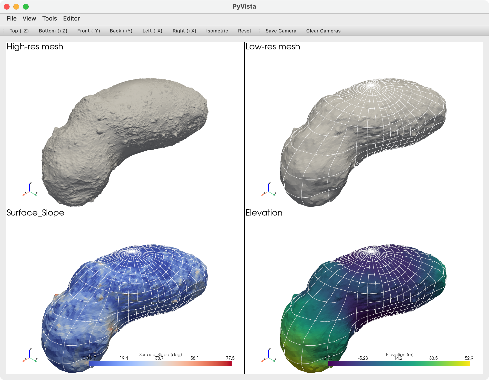
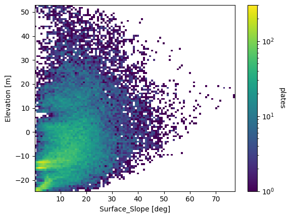
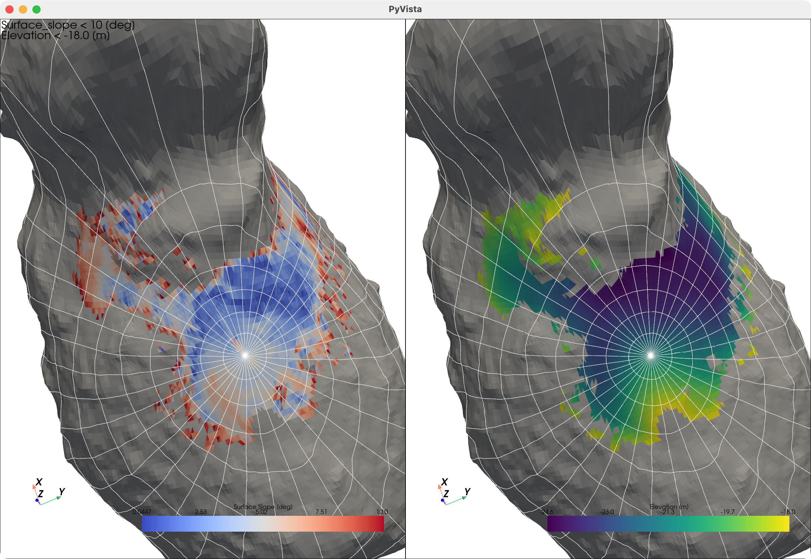
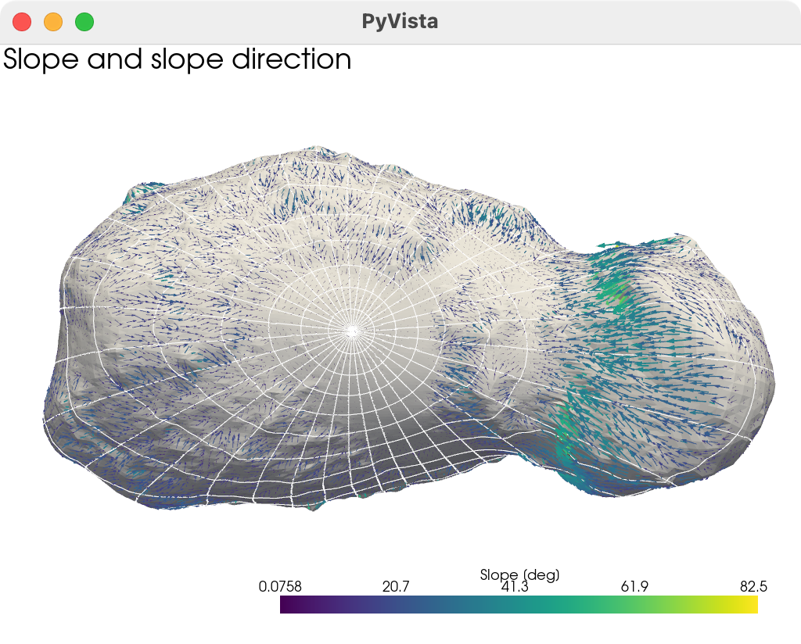
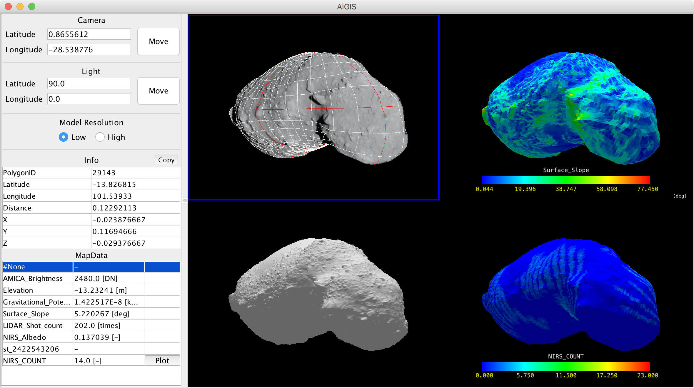

# PyAiGIS/AiGIS2

PyAiGIS/AiGIS2 is an our new project that aims to develop an interactive analysis and visualization environment for irregular-shaped small body exploration data on Jupiter Notebook with Python.

As we introduced our preliminary achievements in the following meeting,

- Nagayoshi and Hirata (2022) AiGIS2, a Jupyter Notebook-based Interactive Analysis and Visualization Tool for Asteroid Exploration Data, AGU Fall Meeting 2022, held in Chicago, IL, 12-16 December 2022, [P25F-2187](https://ui.adsabs.harvard.edu/abs/2022AGUFM.P25F2187N/abstract).
- Nagayoshi and Hirata (2023) AiGIS2, Interactive, Versatile Analysis and Visualization Tool for Asteroid Exploration Data, AGU Fall Meeting 2023, P33F-3207.
- Hirata and Nagayoshi (2024) AiGIS2/PyAiGIS, A Python-based Interactive Analysis And Visualization Tool For Asteroid Exploration Data, LPSC 55, #1877.
  - [Abstract](https://www.hou.usra.edu/meetings/lpsc2024/pdf/1877.pdf)
  - [Poster](https://arcspace.jp/lib/exe/fetch.php?media=aigis2:55thlpsc_pyaigis_20240311.2.pdf)

## Examples

Jupyter Notebook samples are available on https://github.com/AiGIS-PyAiGIS/PyAiGIS-examples.

## Technologies

PyAiGIS/AiGIS2 is developed with the following technologies:

- [VTK](https://vtk.org)
- [PyVista](https://docs.pyvista.org/version/stable/)
- [PyVistaQt](https://qtdocs.pyvista.org)
- [Pandas](https://pandas.pydata.org)
- [Matplotlib](https://matplotlib.org)
- [Numpy](https://numpy.org)
- [SpiceyPy](https://github.com/AndrewAnnex/SpiceyPy)
- [Jupyter Notebook/Jupyter Lab](https://jupyter.org)

## Screenshots

Examples of visualization of Itokawa shape and associated mapdata by
PyAiGIS/AiGIS2.

Multi-view visualization of Itokawa shape and associated mapdata.

2D distribution plot of the surface slope and elevation of Itokawa
mapdata by Matplotlib.

Smooth terrain on Itokawa (regions where the slope is \< 10 \[deg\] and
the elevation is \< -18 \[m\] are colored).

Slope distributions on Itokawa (slope directions and slopes are
visualized with arrows).

## AiGIS (Java Application version)

AiGIS is a 3D GIS designed for analysis on exploration data of irregular-shaped small bodies. The shape of a target body is represented by a polygon model, and geographic information is associated with polygons of the model. AiGIS can visualize and manipulate the shape model and map data on it.

AiGIS and its sample data are availabe at our [website](https://arcspace.jp/doku.php?id=aigis:top).

## Contact

Please send your questions and comments to Naru Hirata
(naru@u-aizu.ac.jp) or our group mail address (arcspace@u-aizu.ac.jp).

## Acknowledgements

AiGIS2/PyAiGIS is developed as a research project by students and staffs at [ARC-Space](https://arcspace.jp), the
[University of Aizu](https://u-aizu.ac.jp/en/).  
The project is/was supported by:

- [ARC-Space](https://arcspace.jp), the University of Aizu, Distinctive Joint Research Center
  supported by MEXT Grant Number
  JPMXP0619217839/JPMXP0622717003/JPMXP0723830458.
